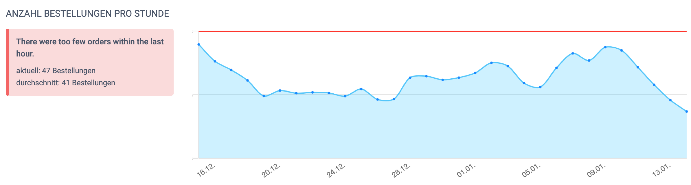
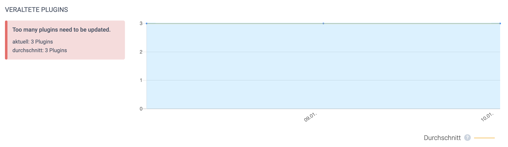

[](https://scrutinizer-ci.com/g/leankoala-gmbh/KoalityShopwarePlugin/?branch=develop)

# koality.io Shopware 5 Plugin

This plugin can be used to continuously monitor a Shopware shop for business metrics. Our idea of [how to monitor a Shopware shop](https://www.koality.io/de/magazin/de/articles/ecommerce/shopware-monitoring) can be found in our magazin.

## Layout (koality.io / abstract)




## Metrics

The following metrics are implemented yet:

- **Minimum orders per hour** - this check fails if the number of orders within the last hour falls under a given threshold. The check provides two time intervals. Rush hour and normal shopping time. This is needed to minimize false positives.


- **Minimum number of active products** - this check fails if there are not enough active products in the should. This will help find import errors.


- **Maximum number products without image** - this check fails if there are too many products that have no review image


## How the plugin works

The plugin provides a JSON endpoint for the Shopware storefront that is secured via a secret token. The endpoint returns the health status of the shop. The health status is a mix of business metrics like "orders per hour" or server metrics like "space left on device".

### Example
```json
{
    "status": "fail",
    "output": "Some Shopware 5 health metrics failed: ",
    "checks": {
        "products.active": {
            "status": "pass",
            "output": "There are enough active products in your shop.",
            "limit": 0,
            "limitType": "min",
            "observedValue": 1,
            "observedUnit": "products",
            "metricType": "time_series_numeric"
        },
        "plugins.updatable": {
            "status": "pass",
            "output": "Not too many plugins need to be updated.",
            "limit": 0,
            "limitType": "max",
            "observedValue": 0,
            "observedUnit": "plugins",
            "metricType": "time_series_numeric"
        },
        "orders.too_few": {
            "status": "fail",
            "output": "There were too few orders within the last hour.",
            "limit": 20,
            "limitType": "min",
            "observedValue": 0,
            "observedUnit": "orders",
            "metricType": "time_series_numeric"
        }
    },
    "info": {
        "creator": "koality.io Shopware 5 Plugin",
        "version": "1.0.0",
        "plugin_url": "https:\/\/www.koality.io\/plugins\/shopware"
    }
}
```

koality.io can interpret this format and will alert if a check fails. At the moment it is needed that the fail or pass decision is made in the Shopware backend. In future versions this can be done in koality.io.

The API endpoint can be found here after installation:
```
https://myshop.com/frontend/health/index?apiKey=<api_key>
```

The format of the Shopware health endpoint is implementing this standard (still RFC):
```
https://tools.ietf.org/html/draft-inadarei-api-health-check-05
```

## Configuration

For configuration, we are using the [Shopware 5 config.xml file](https://developers.shopware.com/developers-guide/plugin-configuration/)
.

## Todo

At the moment this plugin is only a proof of concept. We would be happy if Shopware 6 experts will refactor it to be the best monitoring plugin for the favourite e-commerce solution.


- Check if Shopware needs an update


- Upload the plugin to the Shopware marketplace.


- Only collect status and no metadata. This can be needed of the data is highly confidential.


- Move todos to GitHub Issues


- I18n: the plugin should exist in german and english.


- Check if a plugin needs an update


- Complete the descriptions in the config.xml file


## Frequently asked questions

- **Does the plugin also work for Leankoala?** Yes, it will produce an IETF compatible health check output that can be read by Leankoala as well.


- **Will there be a Shopware 6 plugin as well?** Yes, you can find it in the [Shopware store](https://store.shopware.com/koali57778152180f/koality.io-shopware-monitoring-business.html) already.


- **Can I implement a plugin on my own?** Sure, just give us a call, and we provide you with all the information you need.
